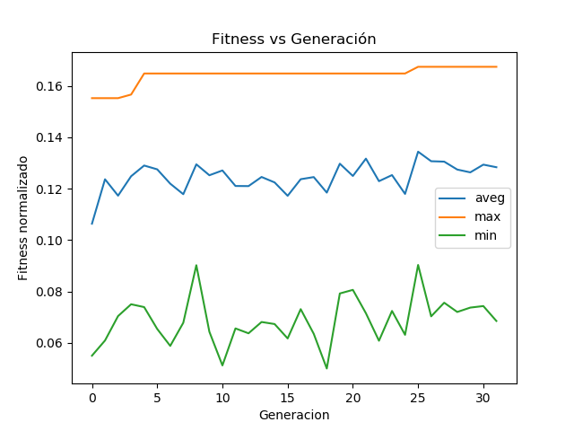

# MOSEntrega2

Implementación de un algoritmo evolutivo para para el aprendizaje de una red neuronal en python 2. 

El código base fué obtenido de Michael Nielsen en:

https://github.com/mnielsen/neural-networks-and-deep-learning.git

